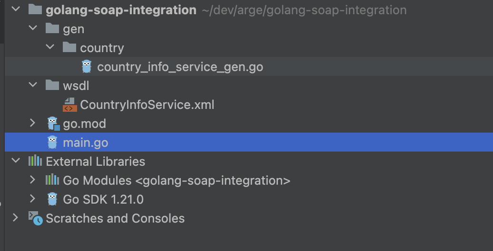

# Golang Soap Integration

Bu blog yazısında, **Golang** kullanarak bir SOAP web servisini nasıl entegre edebileceğinizi göstereceğiz. Örnek olarak, **[http://webservices.oorsprong.org/websamples.countryinfo/CountryInfoService.wso](http://webservices.oorsprong.org/websamples.countryinfo/CountryInfoService.wso)** adresindeki bir web servisini kullanarak **ABD Doları** kullanan ülkeleri sorgulayacağız.

**Adımlar:**

1. **WSDL Dosyasını İndirin:**

Başlamadan önce, web servisinin WSDL dosyasını indirmemiz gerekiyor. WSDL dosyası, web servisinin işlevleri ve veri yapıları hakkında bilgi içerir. WSDL dosyasını şu URL'den indirebilirsiniz:

`http://webservices.oorsprong.org/websamples.countryinfo/CountryInfoService.wso?WSDL`

İndirdiğiniz dosyayı projenizin `wsdl` adında bir klasöre kopyalayın.

**WSDL Dosyasında Ana Servis URL'si Nasıl Bulunur?**

```go
<service name="CountryInfoService">
    <documentation>This DataFlex Web Service opens up country information. 2 letter ISO codes are used for Country code. There are functions to retrieve the used Currency, Language, Capital City, Continent and Telephone code.</documentation>
    <port name="CountryInfoServiceSoap" binding="tns:CountryInfoServiceSoapBinding">
      <soap:address location="http://webservices.oorsprong.org/websamples.countryinfo/CountryInfoService.wso"/>
    </port>
    <port name="CountryInfoServiceSoap12" binding="tns:CountryInfoServiceSoapBinding12">
      <soap12:address location="http://webservices.oorsprong.org/websamples.countryinfo/CountryInfoService.wso"/>
    </port>
  </service>
```

**`<soap:address>`** etiketi bir web servisinin URL'sini içerir. Bu URL, servise yapılan isteklerin gönderileceği internet adresidir. Aşağıda gösterilen etiket:

urada **`location`** özelliği, servisin bulunduğu URL'yi belirtir. Bu örnekte, URL **`http://webservices.oorsprong.org/websamples.countryinfo/CountryInfoService.wso`**'dur. Bu adres, **`CountryInfoService`** adlı servise erişim sağlamak için kullanılır. Yani, bu URL üzerinden servise SOAP istekleri gönderilir ve servis bu isteklere cevap verir.

1. **gowsdl Kütüphanesini Kurun:**

Golang ile SOAP entegrasyonu için `gowsdl` kütüphanesini kullanacağız. Kütüphaneyi kurmak için terminalde şu komutu çalıştırın:

```go
go get -u github.com/hooklift/gowsdl
```

1. **WSDL'den Golang Kodları Oluşturun:**

`gowsdl` komutunu kullanarak WSDL dosyasından Golang kodlarını otomatik olarak oluşturabilirsiniz. Bunu yapmak için terminalde şu komutu çalıştırın:

```go
gowsdl -o country_info_service_gen.go ./wsdl/CountryInfoService.xml
```

Bu komut, `country_info_service_gen.go` adında bir dosya oluşturacaktır. Bu dosya, web servisinin işlevlerini ve veri yapımlarını temsil eden Golang kodlarını içerir.

Şimdi kod kısmına geçelim.

Proje Dizini:



```go
package main

import (
	"fmt"
	"github.com/hooklift/gowsdl/soap"
	"golang-soap-integration/gen/country"
	"log"
)

func main() {

	countryServiceClient := soap.NewClient("http://webservices.oorsprong.org/websamples.countryinfo/CountryInfoService.wso")
	countryService := country.NewCountryInfoServiceSoapType(countryServiceClient)

	fullCountryInfoRequest := &country.CountriesUsingCurrency{SISOCurrencyCode: "USD"}
	fullCountryInfoResponse, err := countryService.CountriesUsingCurrency(fullCountryInfoRequest)
	if err != nil {
		log.Fatalf("Error calling FullCountryInfo: %v", err)
	}

	for i := range fullCountryInfoResponse.CountriesUsingCurrencyResult.TCountryCodeAndName {
		fmt.Printf("Country Code: %s, Country Name: %s\n",
			fullCountryInfoResponse.CountriesUsingCurrencyResult.TCountryCodeAndName[i].SISOCode,
			fullCountryInfoResponse.CountriesUsingCurrencyResult.TCountryCodeAndName[i].SName)
	}

}
```

Şimdi de kodları inceleyelim.

**Web Servisi İstemcisinin Oluşturulması:**

- `soap.NewClient("http://webservices.oorsprong.org/websamples.countryinfo/CountryInfoService.wso")` bir SOAP istemcisi oluşturur. Bu istemci, belirtilen URL'deki SOAP web servisine istek yapmaktan sorumlu olacaktır.

**Servis Bağlantısının Kurulması**:
• **`country.NewCountryInfoServiceSoapType`**: SOAP istemcisini kullanarak **`CountryInfoServiceSoapType`** türünde bir servis nesnesi oluşturur. Bu nesne, web servisinin metodlarını kullanmamızı sağlar.

**İstek Nesnesinin Oluşturulması ve Servise Gönderilmesi**:

- **`fullCountryInfoRequest`**: USD para birimini kullanan ülkeleri sorgulamak için bir istek nesnesi oluşturulur.
- **`countryService.CountriesUsingCurrency`**: Bu metod, oluşturulan istek nesnesini alır ve ilgili SOAP servisine gönderir. Servisten dönen yanıt **`fullCountryInfoResponse`** nesnesinde saklanır.

Bu yazı, Golang ile SOAP entegrasyonunun temellerini sizlere sunmayı amaçladı. Umarım bu adımlar, soap entegrasyon çalışmalarınızda size yardımcı olur.

[Golang ile SOAP Web Servislerini Kolayca Entegre Edin](https://medium.com/@kafkascihangir_31698/golang-ile-soap-web-servislerini-kolayca-entegre-edin-f0e69a20fda1)